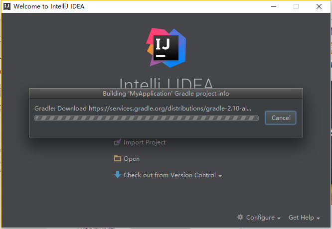

Android开发环境安装&IntelliJ IDEA初步使用
================================================

几年前使用EclipseADT插件玩过一段时间的Android,后因工作的原因暂时停止了对Android的关注。最近思索移动端和服务端消息的安全传递，
奈何没有相关开发环境，又听说IntelliJ IDEA非常火，于是乎冒出一个念头：何不使用IDEA开发下Android试试？本文记录Windows下Android开发环境安装
和IntelliJ IDEA初步使用，以供日后参考。

安装Android开发环境分下面几个步骤

:ref:`my-reference-label1`.

:ref:`my-reference-label2`.

:ref:`my-reference-label3`.

.. _my-reference-label1:

第一步：安装JDK
----------------

作为一个JAVA Coder对于JDK的下载，安装应该都是熟能生巧了在这就不过多的啰嗦了=。=

.. _my-reference-label2:

第二步：下载安装Android SDK
----------------------------------------

安装好JDK后，因为要开发Android程序还需另行下载Android SDK（Software Development Kit）

Android SDK下载网址：http://developer.android.com/sdk/index.html

为了方便使用Android SDK包含的开发工具，我们在系统环境变量中的Path设置Android SDK的安装目录下的tools目录，在下载解压目录双击“SDK Manager.exe”，打开Android SDK Manager，Android SDK Manage负责下载或更新不同版本的SDK包

.. _my-reference-label3:

第三步：下载安装IntelliJ IDEA
--------------------------------

在这步使用IDEA代替Eclipse(开发Android需要ADT插件支持)，IDEA对Android开发的支持是内置的，不再需要其他插件。

IDEA下载网址：http://www.jetbrains.com/idea/ 如果只想进行Android开发可以选择社区版，如果要进行JAVAEE的开发则选择下载旗舰版(破解的确超级麻烦)

社区版和旗舰版区别

安装后我们点击Create New Project，创建一个新的工程：

.. note:: 
   IntelliJ IDEA中的Project，并不是真正的project，相当于Eclipse中的Workspace

   在创建Android项目之前需要在IDEA中配置好JDK和SDK
  
比较下两者之间的概念差异

=========================   ============================================  ========================================= 
   ........                             eclipse                                 IEDA/Android Studio
=========================   ============================================  =========================================
    工作区                          workspace                                 project
    项目                            project                                   module      
    引用                            preference                              module dependency
=========================   ============================================  =========================================

弹出对话框

在上图中选择Android选项Configure your new project,点击下一步：

这跟我们在Eclipse的插件ADT中开发是类似的。接着选择下一步：

在这一步可以选择不同的布局，选择下一步：如果没之前没下载Gradle，这时IEDA会下载Gradle并build刚才的Android项目

https://developer.android.com/studio/index.html  android SDK下载网址

http://www.cnblogs.com/zoupeiyang/p/4034517.html#1  Android开发环境搭建教程

http://www.tuicool.com/articles/a2MNna IntelliJ IDEA 搭建Android集成开发环境

 
